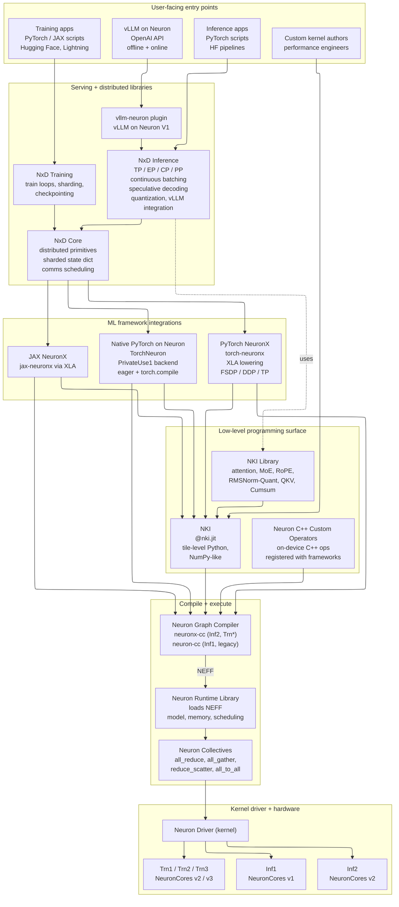
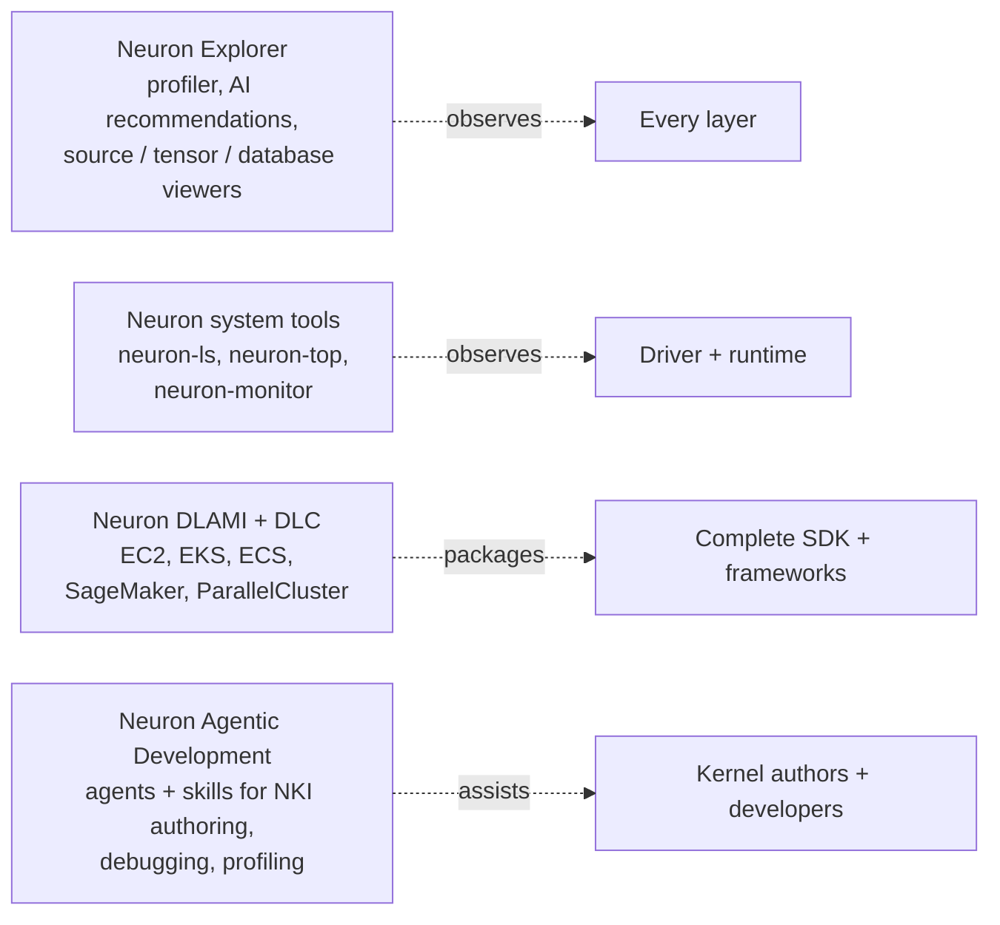

The AWS Neuron SDK is a layered stack. The layers above sit on top of the layers below, and each layer compiles or delegates down until your workload reaches a NeuronCore. This page gives you a single picture of the stack, names every major component, and shows how the pieces connect.

Use this as the map for the rest of the docs: if you know which layer you're working at, you know which section of the docs to read.

## The stack, at a glance

## The layers, one by one

### 1. User-facing entry points

These are the surfaces you use to *start* a Neuron workload. You're one of these by default:

- **[vLLM on Neuron](/libraries/nxd-inference/vllm)** — serving LLMs with the standard vLLM developer experience: OpenAI-compatible API, continuous batching, prefix caching, speculative decoding. Comes in an online-serving variant and an offline-batch variant.
- **[Training apps](/frameworks/torch/pytorch-native-overview)** — your own PyTorch or JAX training script, Hugging Face Transformers, PyTorch Lightning, or a custom training loop that runs on a Trainium instance.
- **[Inference apps](/frameworks/torch/pytorch-native-overview)** — your own PyTorch inference script or a Hugging Face pipeline that runs on an Inferentia or Trainium instance.
- **[Custom kernel authors](/nki/get-started/quickstart-implement-run-kernel)** — performance engineers writing NKI kernels to accelerate a hot path in a larger model.

### 2. Serving and distributed libraries

This layer provides the training loops, inference servers, and distributed primitives that the entry points use. You rarely write against this layer directly unless you're building a framework.

- **[vllm-neuron plugin](/libraries/nxd-inference/vllm)** — the native Neuron integration for vLLM V1. Translates vLLM's model code and request scheduling into calls that run on NeuronCores through NxD Inference.
- **[NxD Training](/libraries/nxd-training)** — distributed training strategies and optimizations: sharding, activation checkpointing, pipeline parallelism, distributed checkpointing.
- **[NxD Inference](/libraries/nxd-inference)** — distributed inference infrastructure: tensor/expert/context/pipeline parallelism (TP/EP/CP/PP), continuous batching, speculative decoding, INT8/FP8 quantization, and the integration point for vLLM. NxD Inference is the primary consumer of the NKI Library.
- **[NxD Core](/libraries/neuronx-distributed/index-inference)** — the foundational distributed-computing primitives shared by NxD Training and NxD Inference: sharding strategies, sharded state dictionaries, collective-communication scheduling.

### 3. ML framework integrations

This layer is the PyTorch or JAX device backend. It translates framework operations into something the compiler can ingest.

- **[Native PyTorch on Neuron (TorchNeuron)](/frameworks/torch/pytorch-native-overview)** — a PrivateUse1 device backend for PyTorch that supports eager execution and `torch.compile`. Existing PyTorch code runs with minimal changes — primarily replacing `cuda` with `neuron`.
- **[PyTorch NeuronX (`torch-neuronx`)](/frameworks/torch)** — the XLA-based PyTorch integration. Lowers PyTorch graphs to XLA / HLO and compiles through `neuronx-cc`. Supports FSDP, DDP, and tensor parallelism.
- **[JAX NeuronX](/frameworks/jax)** — the XLA-based JAX integration (`jax-neuronx`). Compiles JAX programs to NEFF via XLA.

### 4. Low-level programming surface

When you need more control than framework-level compilation provides, you drop into this layer.

- **[NKI — Neuron Kernel Interface](/nki/get-started)** — a Python programming interface for authoring tile-level kernels on NeuronCores, using a NumPy-like API and the `@nki.jit` decorator. Used by NxD Inference for performance-critical operations.
- **[NKI Library](/nki/library)** — a curated collection of pre-optimized kernels (attention, MoE, RoPE, RMSNorm-Quant, QKV, Cumsum, and others) that frameworks and libraries consume. Complete source is published as reference implementations.
- **[Neuron C++ Custom Operators](/neuron-customops)** — a C++ path for authors who want to write on-device operators and register them with a framework. A different programming model from NKI; best when you already have a C++ codebase to port.

### 5. Compile and execute

Everything above eventually flows through here. This is where a program becomes a file a NeuronCore can run.

- **[Neuron Graph Compiler](/compiler)** — takes framework graphs and NKI kernels and produces a **NEFF** file (Neuron Executable File Format). `neuronx-cc` compiles for Inf2 and the Trainium generations; `neuron-cc` compiles for the legacy Inf1. Handles precision conversion (FP32 → BF16 / FP16 / TF32 / FP8), instruction-level optimization, and hardware intrinsics mapping.
- **[Neuron Runtime Library](/neuron-runtime)** — loads NEFF files and executes them on NeuronCores. Owns model management, device allocation, memory management, and execution scheduling.
- **[Neuron Collectives](/neuron-runtime/about/collectives)** — the high-performance collective-communication primitives that the runtime uses for distributed workloads: `all_reduce`, `all_gather`, `reduce_scatter`, `all_to_all`.

### 6. Kernel driver and hardware

At the bottom of the stack:

- **Neuron Driver** — the kernel driver that the runtime uses to talk to the physical accelerator.
- **Hardware generations:**
  - **Inf1** — NeuronCores v1. Inference-optimized, first generation.
  - **Inf2** — NeuronCores v2. Inference-optimized, current generation.
  - **Trn1 / Trn2 / Trn3** — Trainium instances with NeuronCores v2 (Trn1, Trn2) and v3 (Trn3). Training- and inference-capable.

Different NKI features and performance characteristics apply to different hardware. When you read a NKI tutorial or a compiler option, check which generation it targets.

## Cross-cutting components

A few components don't sit in a single layer — they observe or package the others.

- **[Neuron Explorer](/tools/neuron-explorer)** — the unified profiling and optimization suite. AI-driven recommendations, hierarchy and source viewers, tensor and database viewers. Spans frameworks, NKI, compiler, and runtime.
- **[Neuron system tools](/tools)** — `neuron-ls`, `neuron-top`, `neuron-monitor`. The operational view of the driver and runtime.
- **[Neuron DLAMI and DLC](/dlami)** — pre-configured AMIs and containers that package the full SDK, frameworks (PyTorch, JAX), and vLLM. The fastest way to stand up a working environment on EC2, EKS, ECS, SageMaker, or ParallelCluster.
- **[Neuron Agentic Development](/about-neuron/agentic-development-overview)** — open-source agents and skills for Claude Code, Kiro, and other agentic IDEs. Targeted at NKI kernel authoring, debugging, profiling, and analysis.

## How a request flows through the stack

A quick worked example — what happens when you serve an LLM with vLLM on Neuron:

1. A client request hits the **vLLM on Neuron** OpenAI-compatible endpoint.
2. The **vllm-neuron plugin** translates the request into the NxD Inference scheduling model.
3. **NxD Inference** applies continuous batching, selects tensor/pipeline shards via **NxD Core**, and dispatches operators.
4. Hot paths (attention, MoE routing, RMSNorm-Quant) are served by pre-compiled **NKI Library** kernels; the rest is served by the PyTorch / JAX graph compiled through **`neuronx-cc`**.
5. The **Neuron Runtime** loads the NEFF(s), calls **Neuron Collectives** for any distributed step, and drives the **Neuron Driver**.
6. The **Driver** executes on **NeuronCores v2 / v3** on an Inf2 or Trainium instance.

A training run follows the same path through a different entry point: your training script → **NxD Training** → **NxD Core** → your framework → **Neuron Graph Compiler** → **Runtime** → **Driver** → **Trainium NeuronCores**.

## Related topics

- [What is AWS Neuron?](/about-neuron/what-is-neuron) — one-paragraph background on Inferentia, Trainium, and the SDK.
- [NKI Get started](/nki/get-started) — the entry point for custom kernel authors.
- [vLLM on Neuron](/libraries/nxd-inference/vllm) — the entry point for LLM serving.
- [Native PyTorch on Neuron](/frameworks/torch/pytorch-native-overview) — the entry point for training and inference apps.
- [Neuron Graph Compiler](/compiler) and [Neuron Runtime](/neuron-runtime) — the compile-and-execute layer.
- [Neuron Explorer](/tools/neuron-explorer) — profiling and optimization across the whole stack.
